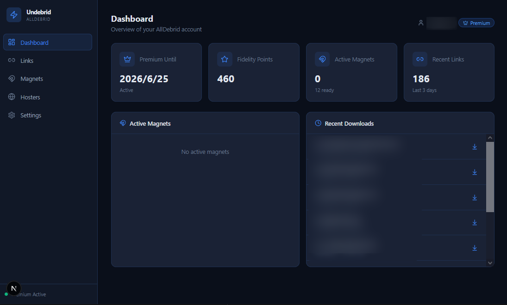

# Undebrid

> [AllDebrid](https://alldebrid.com) のモダンなダウンロードマネージャー。リンク、マグネット、ホスターをダークUIで管理。

[English](README.md)


## 機能

- **ダッシュボード** — プレミアムステータス、ポイント、アクティブマグネット、最近のDL履歴を一覧表示
- **リンクアンロック** — 対応ホスターのURLを貼るだけでプレミアム直リンクを生成
- **マグネット管理** — magnet URI追加 or `.torrent`アップロード。リアルタイムで進捗・速度・残り時間・シーダー数を表示
- **ファイルブラウザ** — マグネット内のファイルツリーを閲覧。個別DL、リンクコピー、ZIP一括DL（フォルダ階層維持）、フォルダ直接保存（Chrome）
- **ホスターステータス** — 50以上の対応プロバイダのオンライン/オフライン状態、使用量クォータ、日次制限を表示
- **削除確認** — マグネット削除・リンク削除時に確認ダイアログ
- **ダークモードUI** — ネイビー×ブルーアクセントのテーマ

## スクリーンショット



## クイックスタート

### 必要なもの

- [Node.js](https://nodejs.org/) 18以上

### セットアップ

```bash
git clone https://github.com/dekotan24/undebrid.git
cd undebrid
npm install
npm run dev
```

起動スクリプトも使えます:

```bash
# Windows
start.bat

# Linux / macOS
./start.sh
```

[http://localhost:3000](http://localhost:3000) を開いて、Settings で [AllDebrid APIキー](https://alldebrid.com/apikeys/) を入力すれば準備完了。

## 技術スタック

| レイヤー | 技術 |
|---------|------|
| フレームワーク | Next.js 15 (App Router, Turbopack) |
| 言語 | TypeScript (strict) |
| スタイリング | Tailwind CSS v4 |
| アイコン | Lucide React |
| API | AllDebrid API v4.1 (APIルート経由でプロキシ) |
| ZIP | JSZip |

## アーキテクチャ

```
src/
├── app/
│   ├── api/ad/          # APIプロキシ (Cookie認証)
│   ├── globals.css      # Tailwindテーマ & カスタムスタイル
│   ├── layout.tsx
│   └── page.tsx         # メインSPAエントリ
├── components/
│   ├── DashboardView    # アカウント概要
│   ├── LinksView        # URLアンロック
│   ├── MagnetsView      # マグネット管理 + ファイルブラウザ
│   ├── HostsView        # プロバイダステータス & クォータ
│   ├── SettingsView     # APIキー & ポーリング設定
│   ├── Sidebar          # ナビゲーション
│   └── ui/              # 共通コンポーネント (Modal, Toast等)
├── lib/
│   ├── api.ts           # AllDebrid APIクライアント
│   ├── folder-download  # ZIP & File System Access DL
│   ├── settings.ts      # localStorage設定
│   └── utils.ts         # フォーマッター & ヘルパー
└── types/
    └── alldebrid.ts     # API型定義
```

### セキュリティ

- APIキーは **httpOnly Cookie** で保存 — クライアントサイドJSには一切公開されない
- AllDebrid APIへの通信は全てNext.js APIルート経由でプロキシ（CORS回避 & キー漏洩防止）
- 第三者へのデータ送信なし

## ライセンス

MIT
